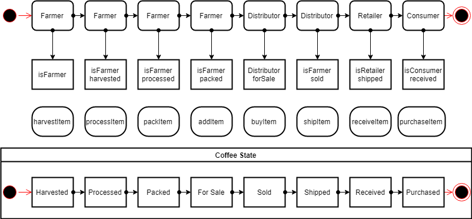

# supply-chain

Ethereum Dap for Tracking Items through Supply Chain. Part of the Udacity Blockchain Nanodegree.
React v16.15.0
nvm use 10
nvm use node

<p align="center">
  <h3 align="center">Supply Chain</h3>

  <p align="center">
Ethereum Dap for Tracking Items through Supply Chain. Part of the Udacity Blockchain Nanodegree.
    <br>
    </p>
</p>

<br>

## Table of contents

- [About the Website](#about-the-website)
- [Technical](#technical)
- [Design](#design)
- [Licence](#license)
- [Versions](#versions)
- [Contact Information](#contact-information)

### About the website

Ethereum Dap for Tracking Items through Supply Chain. Part of the Udacity Blockchain Nanodegree.

<p align="center">
  
</p>

### Technical

#### Technology Used

This project uses: - ReactJS - Tailwind CSS - CSS - JS - NodeJS - EthersJS - Truffle

**React-JS** - Easy to set up single page application with multiple pages.

**Tailwind CSS** - Easier to style components as compared to SCSS and CSS. Also more predictable and makes a site more responsive.

**Ethersjs** - Had lots of trouble using web3js and @truffle/contracts as I was getting lots of errors when using create-react-app. Resorted to using Ethers-js.

- Truffle version `v4.1.14`
- Solidity version `v0.4.24`
- Create-react-app (client) node `v16`
- Truffle node `v10`
- Token Address `0xbced00aB0149c828B9abCa30E0BD3262C49De2bb`, to view on block explorer, see [here](https://rinkeby.etherscan.io/address/0xbced00ab0149c828b9abca30e0bd3262c49de2bb)

#### Running the project

##### Frontend

Ensure node is running on `v16`. Do this, ensure you have [node version manager](https://github.com/nvm-sh/nvm) installed. Once installed you can then run.

```bash
nvm install 16
nvm use 16
```

The npm packages need to be installed in the **app** directory by running

```console
cd client
```

and then

```console
yarn install
```

Once the installation process has been done, to run the frontend of the project, you can run.

```console
yarn start
```

##### Backend

Ensure node is running on `v10`. Do this, ensure you have [node version manager](https://github.com/nvm-sh/nvm) installed. Once installed you can then run.

```bash
nvm install 10
nvm use 10
```

A `.secret` file needs to be created at the root of the project with the private key of the account to deploy the contract. This has already been done.

Install `hdwallet` by running

```console
npm install @truffle/hdwallet-provider
```

To run the truffle development enviroment, run:

```console
truffle develop
```

To compile the smart contract, within the truffle development environment, run:

```console
compile
```

To migrate and create a fresh and clean smart contract session, within the truffle development environment, run:

```console
migrate --refresh
```

To migrate and create a fresh and clean smart contract session, on the rinkeby testnet, run:

```console
migrate --refresh --network rinkeby
```

To run the test cases within the truffle development environment, run:

```console
test
```

### Design

An activity diagram shows busines and software processes as a progression of actions.

<p align="center">
  
</p>

A class diagram describes the attributed and operations fo a class and also the constraints imposed on the system.

<p align="center">
  
</p>

A sequence diagram is an interaction diagram that details how operations are carried out. They captrue the interaction between objects in the contrext of a collaboration.

<p align="center">
  
</p>

A state diagram consists of states, transitions, events and activities. They represent the dynamic view of the system.

<p align="center">
  
</p>

#### CONTRIBUTING

I would/ We'd love to have your help in making **supply-chain** better. The project is still very incomplete, but if there's an issue you'd like to see addressed sooner rather than later, let me(/us) know.

Before you contribute though read the contributing guide here: [Contributing.md](https://github.com/peterokwara/supply-chain/blob/master/CONTRIBUTING.md)

For any concerns, please open an [issue](https://github.com/peterokwara/supply-chain/issues), or just, [fork the project and send a pull request](https://github.com/peterokwara/supply-chain/pulls).

<hr>

### License

- see [LICENSE](https://github.com/peterokwara/supply-chain/blob/master/LICENSE) file

### Versions

- Version 1.0 DATE 08/05/2022

### Contact Information

If you have found any bugs, or have any feedback or questions and or want to post a feature request please use the [Issuetracker](https://github.com/peterokwara/supply-chain/issues) to report them.

<hr>

[](#)

<br>

[](https://github.com/peterokwara/supply-chain/blob/master/LICENSE)
